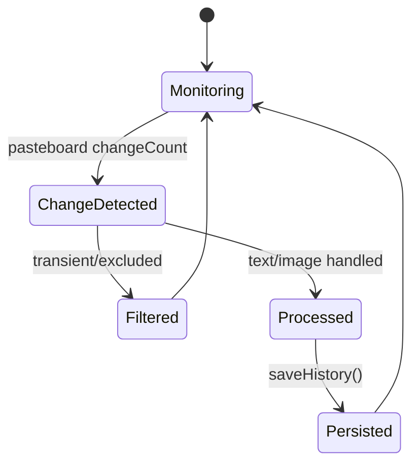
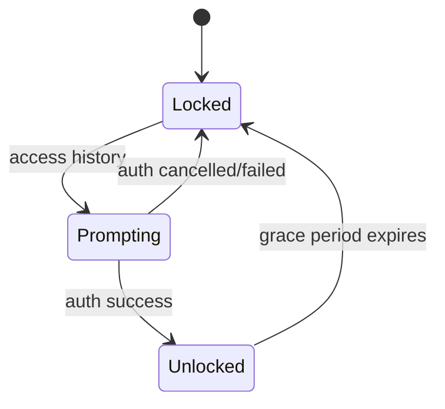
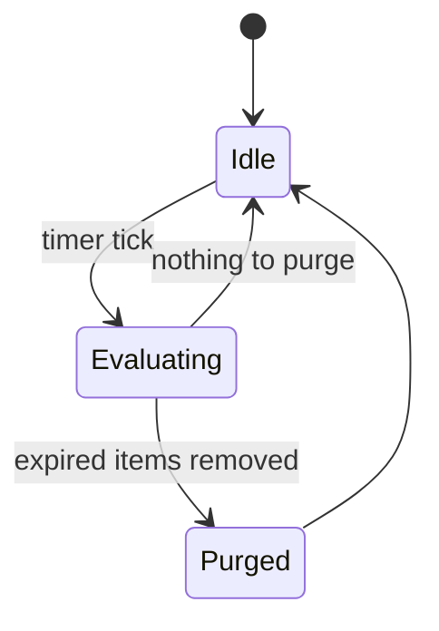

# SaneClip Architecture

Last updated: 2026-02-02

## Purpose

SaneClip is a macOS clipboard manager that captures clipboard history, applies rules/transforms, and provides Touch ID protected access. It also supports snippets, URL schemes, Shortcuts, and widgets.

## Non-goals

- No cloud sync or analytics.
- No clipboard capture for transient or password-manager types.
- No network dependency for core clipboard functionality.

## System Context

- **Menu bar app** with hotkeys and popover UI.
- **Clipboard capture** via NSPasteboard polling (timer-based).
- **Touch ID** via LocalAuthentication for protected access.
- **Widgets** via App Group shared data.
- **Sparkle** for update checks (direct download builds).
- **No GitHub DMG**: DMGs are hosted on Cloudflare R2, not in GitHub.

## Architecture Principles

- Local-first: all data stored on device.
- Safety: sensitive sources and transient pasteboard types are ignored.
- Predictable persistence: JSON files in Application Support + UserDefaults.
- Modular services: capture, rules, security, and UI are separate.

## Core Components

| Component | Responsibility | Key Files |
|---|---|---|
| ClipboardManager | Capture, history, pinning, widget updates | `Core/ClipboardManager.swift` |
| ClipboardRulesManager | Normalize and sanitize content | `Core/ClipboardRulesManager.swift` |
| SnippetManager | Snippet storage + placeholder expansion | `Core/SnippetManager.swift` |
| TextTransformService | Paste transforms | `Core/TextTransformService.swift` |
| SensitiveDataDetector | Detect sensitive content patterns | `Core/Security/SensitiveDataDetector.swift` |
| AutoPurgeService | Time-based auto deletion | `Core/Security/AutoPurgeService.swift` |
| HistoryEncryption | Optional AES-GCM history encryption | `Core/Security/HistoryEncryption.swift` |
| URLSchemeHandler | `saneclip://` command entrypoints | `Core/URLScheme/*` |
| WebhookService | Optional outbound webhook posting | `Core/Webhooks/WebhookService.swift` |

## Data and Persistence

- **History**: `~/Library/Application Support/SaneClip/history.json` (encrypted if enabled).
- **Snippets**: `~/Library/Application Support/SaneClip/snippets.json`.
- **Pinned IDs**: `UserDefaults` key `pinnedItemIDs`.
- **Settings**: `UserDefaults` via `SettingsModel`.
- **Widget data**: App Group `group.com.saneclip.app` file `widget-data.json`.

## Key Flows

### Clipboard Capture -> History
1. Timer checks NSPasteboard changeCount.
2. Ignore transient types and excluded apps.
3. Apply ClipboardRulesManager to text content.
4. Insert into history, trim, and persist to disk.
5. Update widget data in App Group container.

### Protected History Access (Touch ID)
1. User opens history UI.
2. If Touch ID required, authenticate via LocalAuthentication.
3. On success, allow UI access for a grace period.

### Snippet Paste
1. User selects snippet.
2. SnippetManager expands placeholders.
3. ClipboardManager writes expanded text to pasteboard.

## State Machines

### Clipboard Capture Pipeline

| State | Meaning | Entry | Exit |
|---|---|---|---|
| Monitoring | Polling clipboard | timer tick | change detected |
| ChangeDetected | New content available | checkClipboard() | filter/process |
| Filtered | Ignored by rules | excluded/transient | monitoring |
| Processed | Content normalized | processClipboardContent() | persist |
| Persisted | Disk write complete | saveHistory() | monitoring |

### Touch ID Gate

| State | Meaning | Entry | Exit |
|---|---|---|---|
| Locked | History hidden | default | auth prompt |
| Prompting | LAContext prompt | request auth | success/fail |
| Unlocked | History visible | auth success | grace timeout |

### Auto-Purge

| State | Meaning | Entry | Exit |
|---|---|---|---|
| Idle | Waiting | default | timer tick |
| Evaluating | Check age thresholds | cleanupExpiredItems() | purged/idle |
| Purged | Items deleted + saved | saveHistory() | idle |

## Permissions and Privacy

- Uses LocalAuthentication for Touch ID gating.
- Excludes transient clipboard types and known password manager bundle IDs.
- Network requests are optional (webhooks, Sparkle updates).

## Build and Release Truth

- **Single source of truth**: `.saneprocess` in the project root.
- **Build/test**: `./scripts/SaneMaster.rb verify` (no raw xcodebuild).
- **Release**: `./scripts/SaneMaster.rb release` (delegates to SaneProcess `release.sh`).
- **DMGs**: uploaded to Cloudflare R2 (not committed to GitHub).
- **Appcast**: Sparkle feed configured in `SaneClip/Info.plist`.

## Testing Strategy

- Unit tests in `Tests/`.
- Use `./scripts/SaneMaster.rb verify` for build + tests.
- Manual checks: clipboard capture, Touch ID prompt, widgets.

## Risks and Tradeoffs

- Clipboard polling can miss extremely fast changes.
- Encrypted history increases CPU overhead on save/load.
- Widgets rely on App Group access and shared file writes.
