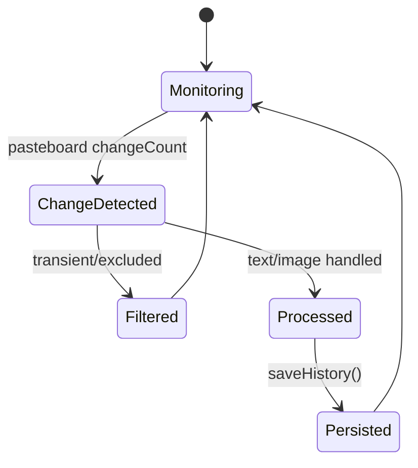
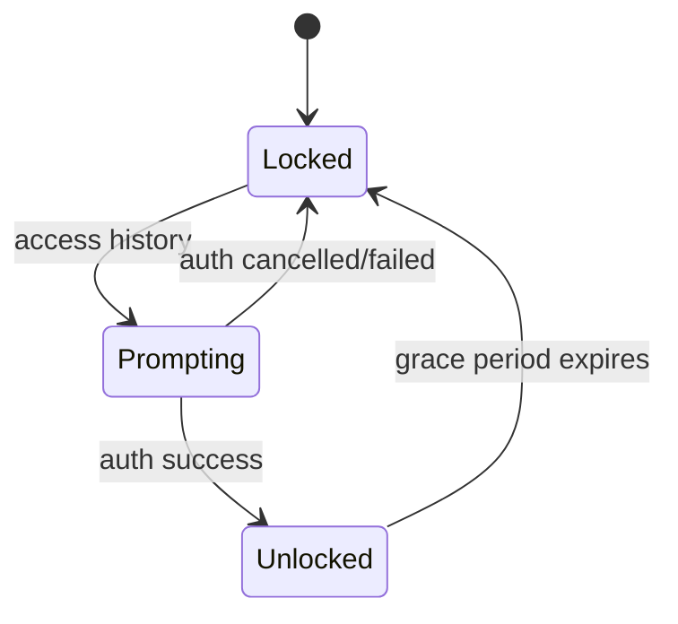
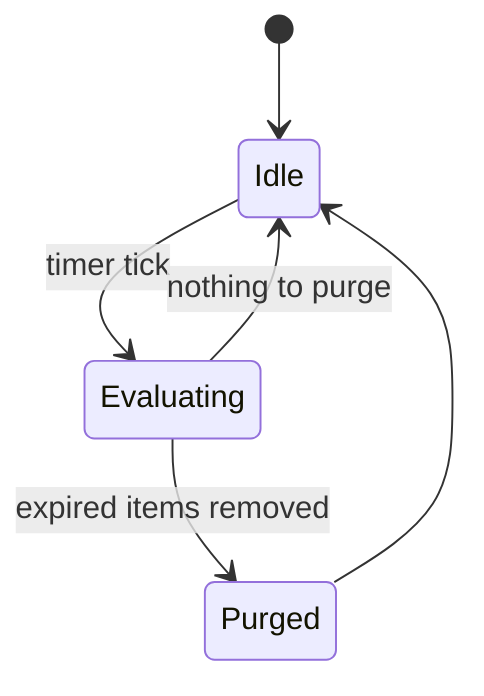

# SaneClip Architecture

> [README](README.md) · [ARCHITECTURE](ARCHITECTURE.md) · [DEVELOPMENT](DEVELOPMENT.md) · [PRIVACY](PRIVACY.md) · [SECURITY](SECURITY.md)

Last updated: 2026-06-16

## Purpose

SaneClip is a macOS clipboard manager that captures clipboard history, applies rules/transforms, and provides Touch ID protected access. It also supports snippets, URL schemes, Shortcuts, and widgets.

## Non-goals

- No SaneApps clipboard sync server and no ad-tech analytics. Optional iCloud sync uses the customer's iCloud account, and privacy-preserving operational counts never include clipboard content.
- No clipboard capture for transient or password-manager types.
- No network dependency for core clipboard functionality.

## System Context

- **Menu bar app** with hotkeys and popover UI.
- **Clipboard capture** via NSPasteboard polling (timer-based).
- **Touch ID** via LocalAuthentication for protected access.
- **Widgets** via App Group shared data.
- **Sparkle** for update checks (direct download builds).
- **No GitHub DMG**: DMGs are hosted on Cloudflare R2, not in GitHub.

## Architecture Principles

- Local-first: all data stored on device.
- Safety: sensitive sources and transient pasteboard types are ignored.
- Predictable persistence: JSON files in Application Support + UserDefaults.
- Modular services: capture, rules, security, and UI are separate.

## Core Components

| Component | Responsibility | Key Files |
|---|---|---|
| ClipboardManager | Capture, history, pinning, widget updates | `Core/ClipboardManager.swift` |
| ClipboardRulesManager | Normalize and sanitize content | `Core/ClipboardRulesManager.swift` |
| SnippetManager | Snippet storage + placeholder expansion | `Core/SnippetManager.swift` |
| TextTransformService | Paste transforms | `Core/TextTransformService.swift` |
| SensitiveDataDetector | Detect sensitive content patterns | `Core/Security/SensitiveDataDetector.swift` |
| AutoPurgeService | Time-based auto deletion | `Core/Security/AutoPurgeService.swift` |
| HistoryEncryption | Optional AES-GCM history encryption | `Core/Security/HistoryEncryption.swift` |
| URLSchemeHandler | `saneclip://` command entrypoints | `Core/URLScheme/*` |
| WebhookService | Optional outbound webhook posting | `Core/Webhooks/WebhookService.swift` |

## Data and Persistence

- **History**: `~/Library/Application Support/SaneClip/history.json` (encrypted if enabled).
- **Snippets**: `~/Library/Application Support/SaneClip/snippets.json`.
- **Pinned IDs**: `UserDefaults` key `pinnedItemIDs`.
- **Settings**: `UserDefaults` via `SettingsModel`.
- **Widget data**: App Group `group.com.saneclip.app` file `widget-data.json`.

## Key Flows

### Clipboard Capture -> History
1. Timer checks NSPasteboard changeCount.
2. Ignore transient types and excluded apps.
3. Apply ClipboardRulesManager to text content.
4. Insert into history, trim, and persist to disk.
5. Update widget data in App Group container.

### Protected History Access (Touch ID)
1. User opens history UI.
2. If Touch ID required, authenticate via LocalAuthentication.
3. On success, allow UI access for a grace period.

### Snippet Paste
1. User selects snippet.
2. SnippetManager expands placeholders.
3. ClipboardManager writes expanded text to pasteboard.

### On-Device AI Text Preview
1. A text clip's `AI — On Device (macOS 26+)` menu creates a transient request for Rewrite, Summarize, or Extract Key Points.
2. `TextTransformService` conservatively rejects empty input and input over 2,000 UTF-8 bytes before checking the macOS 26 Foundation Models availability state. Bounding encoded bytes instead of user-perceived characters prevents emoji, combining marks, and other token-dense text from bypassing the safety limit while leaving room within Apple's 4,096-token context for instructions and the response. It then creates a fresh `LanguageModelSession` with no tools. Static action policy is supplied as `Instructions`; the selected clip alone is supplied as `Prompt`.
3. The result stays in the preview sheet until the customer explicitly chooses Copy or Cancel. Copy writes the result to the pasteboard without changing clipboard history; Cancel changes nothing.
4. No prompt, response, transcript, debug context, content length, or generated result is persisted or logged by this flow.

## State Machines

### Clipboard Capture Pipeline

```mermaid
stateDiagram-v2
  [*] --> Monitoring
  Monitoring --> ChangeDetected: pasteboard changeCount
  ChangeDetected --> Filtered: transient/excluded
  ChangeDetected --> Processed: text/image handled
  Processed --> Persisted: saveHistory()
  Persisted --> Monitoring
  Filtered --> Monitoring
```

| State | Meaning | Entry | Exit |
|---|---|---|---|
| Monitoring | Polling clipboard | timer tick | change detected |
| ChangeDetected | New content available | checkClipboard() | filter/process |
| Filtered | Ignored by rules | excluded/transient | monitoring |
| Processed | Content normalized | processClipboardContent() | persist |
| Persisted | Disk write complete | saveHistory() | monitoring |

### Touch ID Gate

```mermaid
stateDiagram-v2
  [*] --> Locked
  Locked --> Prompting: access history
  Prompting --> Unlocked: auth success
  Prompting --> Locked: auth cancelled/failed
  Unlocked --> Locked: grace period expires
```

| State | Meaning | Entry | Exit |
|---|---|---|---|
| Locked | History hidden | default | auth prompt |
| Prompting | LAContext prompt | request auth | success/fail |
| Unlocked | History visible | auth success | grace timeout |

### Auto-Purge

```mermaid
stateDiagram-v2
  [*] --> Idle
  Idle --> Evaluating: timer tick
  Evaluating --> Purged: expired items removed
  Evaluating --> Idle: nothing to purge
  Purged --> Idle
```

| State | Meaning | Entry | Exit |
|---|---|---|---|
| Idle | Waiting | default | timer tick |
| Evaluating | Check age thresholds | cleanupExpiredItems() | purged/idle |
| Purged | Items deleted + saved | saveHistory() | idle |

## Permissions and Privacy

- Uses LocalAuthentication for Touch ID gating.
- Excludes transient clipboard types and known password manager bundle IDs.
- Network requests are optional (webhooks, Sparkle updates).
- Foundation Models text actions run through Apple's on-device system model with no tools, network request, downloaded model, or background analysis. They add no TCC permission, Info.plist usage description, privacy-manifest collected-data type, or required-reason API category. Existing onboarding and permission screens therefore remain unchanged; model availability is explained in the transient preview.

## Build and Release Truth

- **Single source of truth**: `.saneprocess` in the project root.
- **Build/test**: `./scripts/SaneMaster.rb verify` (no raw xcodebuild).
- **Release**: run `./scripts/SaneMaster.rb release_preflight`, then
  `./scripts/SaneMaster.rb appstore_preflight` for App Store lanes, then the
  guarded SaneProcess `release.sh --full --version --notes --deploy` pipeline.
- **Direct channel**:
  - DMGs uploaded to Cloudflare R2 (not committed to GitHub)
  - Sparkle feed configured in `SaneClip/Info.plist`
  - Lemon Squeezy handles direct licensing
  - Direct download + Sparkle is canonical; Homebrew is optional only when intentionally published and the Basic/Pro gate is verified
- **App Store channel**:
  - StoreKit + App Store updates
  - no external licensing path in the App Store build
- **Setapp channel**:
  - separate `-setapp` bundle ID
  - Setapp entitlement/update path
  - no Sparkle
  - no Lemon Squeezy activation UI
  - no donate/sponsorship UI in the Setapp build
  - launch-at-login should remain explicit user choice in the Setapp lane instead of being silently treated as channel-default behavior
- **Channel rule**:
  - direct Lemon Squeezy business stays in place
  - Setapp using Stripe does not replace the website/direct flow
- **Known Setapp gotchas**:
  - Setapp packages must stay universal: main app, extensions, and `MPSupportedArchitectures` must include both `arm64` and `x86_64`; `setapp_package` and `setapp_upload --validate-only` enforce this before upload
  - Setapp packages that sign iCloud/app-group/keychain entitlements must embed a matching `Contents/embedded.provisionprofile`; notarization and `spctl` can pass while LaunchServices still fails with launchd/RBS error 163 if the profile is missing
  - The final Setapp ZIP must be expanded, quarantined, and opened on the Mini before upload; static signing checks alone are not release proof
  - Setapp final ZIP validation must reject Sparkle framework residue, Lemon
    Squeezy/license-key/checkout strings, and donation/direct-download copy in
    the uploaded archive
  - Setapp listing screenshots are manifest-backed owned-site app-in-use
    screenshots and must pass 16:10 / 1280x800 validation before upload
  - if the macOS Setapp lane ships widgets or extensions, the extension bundle-ID family must be audited with the Setapp lane instead of assumed to inherit safely
  - Setapp public release notes must be user-facing. Review-team comments,
    icon geometry, archive/signing details, and direct-channel licensing/update
    terms belong in private review comments or email, not in Release notes.

## Testing Strategy

- Unit tests in `Tests/`.
- Use `./scripts/SaneMaster.rb verify` for build + tests.
- Manual checks: clipboard capture, Touch ID prompt, widgets.
- Channel checks:
  - direct = Sparkle + Lemon Squeezy path
  - App Store = StoreKit + App Store-safe UI
  - Setapp = Setapp entitlement/update path with no Sparkle/direct-pay drift

## Risks and Tradeoffs

- Clipboard polling can miss extremely fast changes.
- Encrypted history increases CPU overhead on save/load.
- Widgets rely on App Group access and shared file writes.
