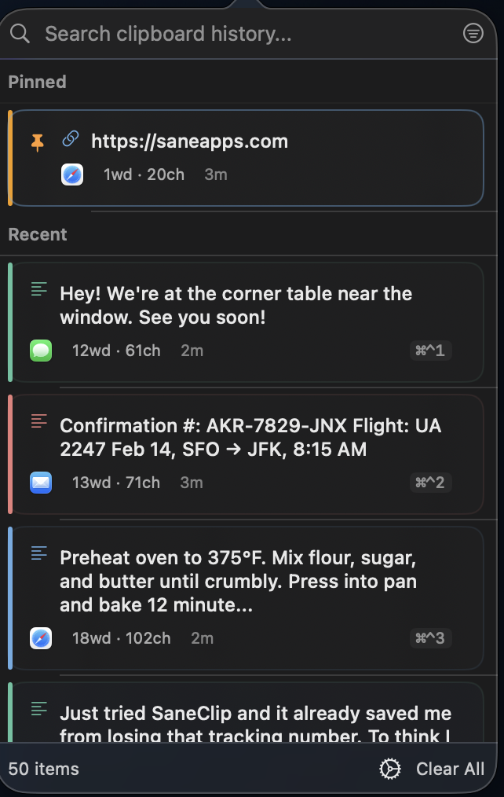

<div align="center">

# 🔐 SaneClip

### The Only Clipboard Manager That Takes Privacy Seriously

**AES-256 encryption · Touch ID protection · 100% local · Zero analytics**

[](https://github.com/sane-apps/SaneClip/stargazers)
[](https://www.gnu.org/licenses/gpl-3.0)
[](https://www.apple.com/macos/)
[](https://saneclip.com)

> **⭐ Star this repo if you find it useful!** · **[💰 Buy the DMG for $6.99](https://saneclip.com)** · Takes 30 seconds, keeps development alive



<p>
  <a href="#whats-new">What's New</a> •
  <a href="#features">Features</a> •
  <a href="#security">Security</a> •
  <a href="#automation">Automation</a> •
  <a href="ROADMAP.md">Roadmap</a>
</p>

</div>

---

## 🚨 The Problem

Most clipboard managers are **security nightmares**:
- ❌ Store your passwords, API keys, and credit cards in **plaintext**
- ❌ Send your clipboard data to the **cloud**
- ❌ Track everything you copy with **analytics**
- ❌ Let **any app** access your clipboard history without permission

**You deserve better.**

---

## ✅ The Solution

SaneClip is the **first clipboard manager** built with security as the foundation:

| Security Feature | What It Does |
|------------------|--------------|
| **🔒 AES-256-GCM Encryption** | Your clipboard history is encrypted at rest. Even if malware accesses your disk, it can't read your clips. |
| **🔐 Touch ID Protection** | Lock your history behind biometrics. 30-second grace period means no repeated prompts. |
| **🛡️ Keychain Integration** | All secrets (webhook keys, encryption keys) stored in macOS Keychain — never in JSON files. |
| **🚫 HTTPS Enforcement** | Webhooks must use HTTPS (localhost exempt for testing). No accidental plaintext transmission. |
| **⚠️ URL Scheme Confirmation** | Destructive commands (copy, paste, clear) require user approval. No silent data loss. |
| **📵 App Exclusions** | Block 1Password, banking apps, or any sensitive app from clipboard capture entirely. |
| **🕵️ Sensitive Data Detection** | Automatically flags credit cards, SSNs, API keys, passwords, private keys. |

**100% local. Zero cloud. Zero analytics. Zero telemetry.**

---

## 🆕 What's New in v2.0

**Security Hardening + App Store Release (Feb 2026)**

- ✅ **History Encryption-at-Rest** — AES-256-GCM encryption enabled by default
- ✅ **Keychain Integration** — All secrets stored securely in macOS Keychain
- ✅ **URL Scheme Confirmation** — Destructive commands require user approval
- ✅ **HTTPS Enforcement** — Webhooks must use HTTPS
- ✅ **Seamless Migration** — Existing plaintext data auto-migrates to encrypted format
- ✅ **Paste Stack Order** — FIFO/LIFO modes for paste stack
- 🏪 **Now on the Mac App Store** — [Get SaneClip on the App Store](https://apps.apple.com/app/saneclip/id6758898132)

[Full Changelog](CHANGELOG.md)

---

## ⚡️ Features

### Keyboard-First Design

- **⌘⇧V** — Open clipboard history
- **⌘⌃1-9** — Paste items 1-9 instantly
- **⌘⇧⌥V** — Paste as plain text
- **⌘⌃V** — Paste from stack (oldest or newest first — configurable in Settings)
- **↑↓ or j/k** — Navigate through history

### Smart Snippets

Create reusable text templates with dynamic placeholders:

```
Hello {{name}},

Thank you for your {{reason}}.
Today's date is {{date}}.

Best regards,
{{clipboard}}
```

**Built-in placeholders:**
- `{{name}}` — Prompts for input when pasting
- `{{date}}` — Auto-fills current date
- `{{time}}` — Auto-fills current time
- `{{clipboard}}` — Current clipboard content

### Text Transforms

Right-click any text item and choose "Paste As..." to transform before pasting:

| Transform | Description |
|-----------|-------------|
| UPPERCASE | Convert to all caps |
| lowercase | Convert to all lowercase |
| Title Case | Capitalize each word |
| Trimmed | Remove leading/trailing whitespace |
| Reverse Lines | Reverse order of lines |
| JSON Pretty Print | Format JSON with indentation |
| Strip HTML | Remove HTML tags, keep text |
| Markdown to Plain | Strip markdown formatting |

### Clipboard Rules

Automatic processing applied to every copy:

- **Strip URL Tracking** — Removes utm_*, fbclid, gclid, etc.
- **Auto-Trim Whitespace** — Remove leading/trailing whitespace
- **Lowercase URLs** — Convert URLs to lowercase
- **Normalize Line Endings** — Convert to consistent line breaks
- **Remove Duplicate Spaces** — Collapse multiple spaces

### Organization

- **📌 Pin Favorites** — Keep frequently-used text always accessible
- **🔍 Instant Search** — Filter by content, source app, or date
- **🎨 Source-Aware Colors** — Every clip is color-coded by source app (Messages green, Safari blue, Mail red, and more)
- **📱 App Source Attribution** — See which app each clip came from
- **🔄 Duplicate Detection** — Identical clips automatically consolidate
- **📊 Paste Count Badges** — Track how many times you've used each item
- **⏱️ Auto-Expire** — Delete old items after 1h, 24h, 7d, or 30d
- **🖼️ Image Capture** — Copies images too, not just text

### macOS Widgets

Add SaneClip widgets to your desktop or Notification Center:

| Widget | Sizes | Description |
|--------|-------|-------------|
| **Recent Clips** | Small, Medium | Shows your 3-5 most recent clipboard items |
| **Pinned Clips** | Small, Medium | Quick access to your pinned favorites |

### Data Management

- **📤 Export History** — Export to JSON with timestamps and metadata
- **📥 Import History** — Import previously exported history
- **⚙️ Settings Sync** — Backup or transfer settings to another Mac
- **📊 Storage Stats** — View detailed statistics about your clipboard

---

## 🤖 Automation

### URL Scheme

Control SaneClip programmatically via `saneclip://` URLs:

| URL | Action |
|-----|--------|
| `saneclip://paste?index=0` | Paste item at index |
| `saneclip://search?q=keyword` | Open search with query |
| `saneclip://snippet?name=MySnippet` | Paste snippet by name |
| `saneclip://copy?text=Hello` | Copy text to clipboard |
| `saneclip://history` | Show history window |
| `saneclip://clear` | Clear history (with confirmation) |

### Siri Shortcuts

SaneClip integrates with Shortcuts.app via App Intents:

- **Get Clipboard History** — Returns recent text items
- **Paste Clipboard Item** — Pastes item at specified index
- **Search Clipboard** — Search history and return matches
- **Copy to SaneClip** — Copy text to clipboard
- **Clear Clipboard History** — Clear all non-pinned items
- **Paste Snippet** — Paste a saved snippet by name
- **List Snippets** — Returns all snippet names

### Webhooks

Send HTTP notifications when clipboard events occur with HMAC-SHA256 signatures and retry logic.

---

## 🔒 Security

SaneClip is **privacy-first**:

- ✅ **100% On-Device** — All processing stays on your Mac
- ✅ **iCloud Sync Only** — Syncs between your devices via iCloud, no third-party servers
- ✅ **Zero Analytics** — No tracking, no telemetry, no data collection
- ✅ **Open Source** — Verify yourself at [github.com/sane-apps/SaneClip](https://github.com/sane-apps/SaneClip)
- ✅ **GPL v3 License** — Community-auditable, copyleft protection

**Sensitive Data Detection:**
- Credit cards (Luhn algorithm validation)
- Social Security Numbers
- API keys (OpenAI, AWS, GitHub, Slack, Stripe, Google, etc.)
- Passwords and private keys (SSH, PGP/GPG)
- Email addresses

**Auto-Purge Rules:** Configure automatic deletion of sensitive items after 1 minute, 5 minutes, or 1 hour.

See [PRIVACY.md](PRIVACY.md) and [SECURITY.md](SECURITY.md) for full details.

---

## 📦 Installation

**Download the latest DMG from [saneclip.com](https://saneclip.com) — $6.99 one-time purchase, free updates for life.**

> *I wanted to make it $5, but processing fees and taxes were... insane. — Mr. Sane*

**Sparkle auto-updates** keep you current — once installed, updates are delivered automatically.

### Requirements

**macOS App:**
- macOS 15.0 (Sequoia) or later
- Apple Silicon Mac (M1+)

**iOS Companion App:**
- iOS 18.0 or later
- iPhone or iPad

---

## 🛠️ Development

> **Cloning without starring?** For real? **[⭐ Star it first](https://github.com/sane-apps/SaneClip)**. Help others discover quality open source.

```bash
# Clone the repo
git clone https://github.com/sane-apps/SaneClip.git
cd SaneClip

# Build + test (preferred)
./scripts/SaneMaster.rb verify

# Launch
./scripts/SaneMaster.rb launch
```

SaneMaster runs XcodeGen when needed; only run `xcodegen generate` manually if you add files and want to refresh immediately.

See [DEVELOPMENT.md](DEVELOPMENT.md) for detailed setup and [CONTRIBUTING.md](CONTRIBUTING.md) for coding standards.

### 🤝 Contributing

Before opening a PR:
1. **[⭐ Star the repo](https://github.com/sane-apps/SaneClip)** (if you haven't already)
2. Read [CONTRIBUTING.md](CONTRIBUTING.md)
3. Open an issue first to discuss major changes

**Building from source?** Consider [buying the DMG](https://saneclip.com) to support continued development.

---

## 📚 Documentation

| Document | Purpose |
|----------|---------|
| [ROADMAP.md](ROADMAP.md) | Feature plans and timeline |
| [CONTRIBUTING.md](CONTRIBUTING.md) | How to contribute |
| [DEVELOPMENT.md](DEVELOPMENT.md) | Development setup and guidelines |
| [CHANGELOG.md](CHANGELOG.md) | Version history |
| [SECURITY.md](SECURITY.md) | Security policy |
| [PRIVACY.md](PRIVACY.md) | Privacy practices |

---

## 💬 Support

- 🐛 [Report a Bug](https://github.com/sane-apps/SaneClip/issues/new?template=bug_report.md)
- 💡 [Request a Feature](https://github.com/sane-apps/SaneClip/issues/new?template=feature_request.md)
- ❤️ [Sponsor on GitHub](https://github.com/sponsors/MrSaneApps)

### Crypto Donations

| Currency | Address |
|----------|---------|
| BTC | `3Go9nJu3dj2qaa4EAYXrTsTf5AnhcrPQke` |
| SOL | `FBvU83GUmwEYk3HMwZh3GBorGvrVVWSPb8VLCKeLiWZZ` |
| ZEC | `t1PaQ7LSoRDVvXLaQTWmy5tKUAiKxuE9hBN` |

---

## 🌟 Why Choose SaneClip?

| Other Clipboard Managers | SaneClip |
|--------------------------|----------|
| ❌ Plaintext storage | ✅ AES-256-GCM encryption |
| ❌ Cloud sync (data exposure risk) | ✅ 100% local, zero servers |
| ❌ Analytics and telemetry | ✅ Zero tracking, zero telemetry |
| ❌ Closed source | ✅ Open source (GPL v3) |
| ❌ Subscription pricing | ✅ $6.99 one-time, free updates |
| ❌ No Touch ID protection | ✅ Biometric locks with grace period |
| ❌ No sensitive data detection | ✅ Auto-flags credit cards, API keys, SSNs |

---

## 💡 Found a Bug? Want a Feature?

**[⭐ Star the repo first](https://github.com/sane-apps/SaneClip)** — Then open an issue. Stars help us prioritize which projects get the most attention.

- 🐛 [Report a Bug](https://github.com/sane-apps/SaneClip/issues/new?template=bug_report.md)
- 💡 [Request a Feature](https://github.com/sane-apps/SaneClip/issues/new?template=feature_request.md)

**Cloning without starring?** For real bro? Gimme that star!

---

## 📱 iOS Companion App (Free)

Your clipboard history, on your iPhone and iPad. Free with SaneClip for Mac.

- **History Tab** — Browse recent clips with source-aware colors, tap-to-copy, and haptic feedback
- **Pinned Tab** — Quick access to your favorites
- **Detail View** — Full content preview with selectable text, tappable URLs, and image rendering
- **Siri Shortcuts** — "Get recent clips", "Search clips", "Copy last clip" via Shortcuts app
- **Share Extension** — Save text and URLs to SaneClip from any app's share sheet
- **iOS Widgets** — Recent and Pinned clips for Home Screen and Lock Screen
- **iCloud Sync** — Keep your clipboard in sync across all your devices via CKSyncEngine

---

## 🏆 Compare SaneClip

Looking at alternatives? Here's how SaneClip stacks up:

| Feature | SaneClip | Paste | Maccy | Pastebot | CopyClip |
|---------|:--------:|:-----:|:-----:|:--------:|:--------:|
| **AES-256 Encryption** | ✅ | ❌ | ❌ | ❌ | ❌ |
| **Touch ID Protection** | ✅ | ❌ | ❌ | ❌ | ❌ |
| **Sensitive Data Detection** | ✅ | ❌ | ❌ | ❌ | ❌ |
| **Password Manager Safety** | ✅ | ❌ | ❌ | ❌ | ❌ |
| **Clipboard Rules** | ✅ | ❌ | ❌ | ❌ | ❌ |
| **Webhooks & URL Schemes** | ✅ | ❌ | ❌ | ❌ | ❌ |
| **Siri Shortcuts & Widgets** | ✅ | ❌ | ❌ | ❌ | ❌ |
| App Exclusions | ✅ | ✅ | ✅ | ❌ | ❌ |
| Source App Colors | ✅ | ✅ | ❌ | ✅ | ❌ |
| Text Transforms | ✅ | ❌ | ❌ | ✅ | ❌ |
| Paste Stack | ✅ | ❌ | ❌ | ✅ | ❌ |
| Snippets & Placeholders | ✅ | ✅ | ❌ | ✅ | ❌ |
| iOS Companion App | ✅ Free | ✅ Paid | ❌ | ❌ | ❌ |
| iCloud Sync | ✅ | ✅ | ❌ | ✅ | ❌ |
| Open Source | ✅ | ❌ | ✅ | ❌ | ❌ |
| 100% Private | ✅ | ❌ | ✅ | ✅ | ✅ |
| **Price** | **$6.99** | $30/yr | Free | $13 | Free |

**Bottom line:** The first 7 rows are SaneClip-only features. No other clipboard manager offers encryption, Touch ID, sensitive data detection, or webhook automation. If privacy and security matter to you, SaneClip is the only choice.

---

## 📝 License

GPL v3 — see [LICENSE](LICENSE) for details.

---

<div align="center">

**Made with ❤️ in 🇺🇸 by [Mr. Sane](https://github.com/MrSaneApps)**

**Not fear, but power, love, sound mind** — 2 Timothy 1:7

</div>
