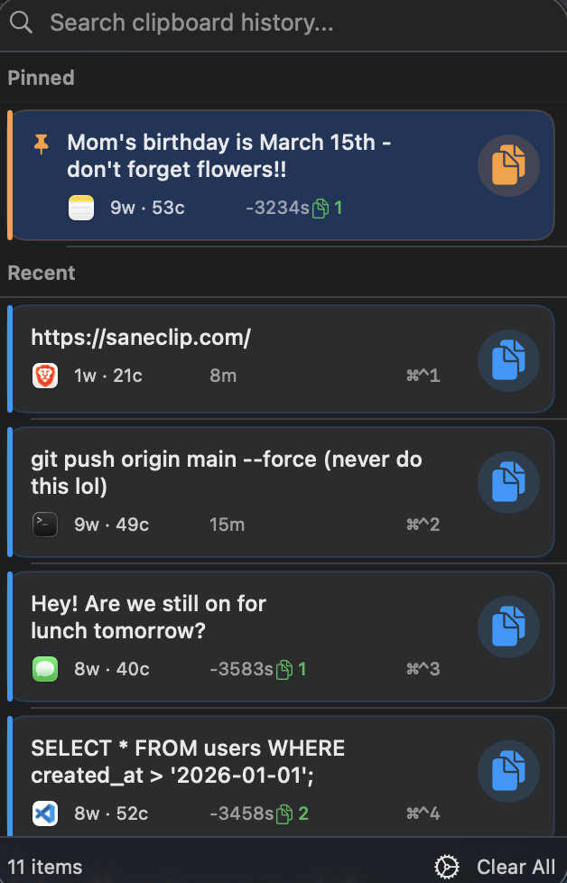

<div align="center">

# 🔐 SaneClip

### The Only Clipboard Manager That Takes Privacy Seriously

**Privacy-first clipboard history · On-device by default · No personal-content upload · Full Pro for 14 days, then pay once**

[](https://github.com/sane-apps/SaneClip/stargazers)
[](LICENSE)
[](https://www.apple.com/macos/)
[](https://saneclip.com)
[-black?style=flat-square)](https://github.com/serhii-londar/open-source-mac-os-apps)

> **⭐ Star this repo if you find it useful!** · **[⬇️ Start a free 14-day Pro trial](https://saneclip.com/download)** · **[💰 Buy Pro for $14.99 once](https://go.saneapps.com/buy/saneclip?ref=github-readme)**



<p>
  <a href="#whats-new">What's New</a> •
  <a href="#features">Features</a> •
  <a href="#security">Security</a> •
  <a href="#automation">Automation</a> •
</p>

</div>

---

## 🚨 The Problem

Most clipboard managers are **security nightmares**:
- ❌ Store your passwords, API keys, and credit cards in **plaintext**
- ❌ Send your clipboard data to the **cloud**
- ❌ Track everything you copy with **analytics**
- ❌ Let **any app** access your clipboard history without permission

**You deserve better.**

---

## ✅ The Solution

SaneClip is the **first clipboard manager** built with security as the foundation:

| Security Feature | What It Does |
|------------------|--------------|
| **🔒 AES-256-GCM Encryption (Pro)** | Encrypts your clipboard history at rest. Even if malware accesses your disk, it can't read your clips. |
| **🔐 Touch ID History Lock (Pro)** | Locks history behind biometrics. 30-second grace period means no repeated prompts. |
| **🛡️ Keychain Integration** | Local protection keys are stored in macOS Keychain — never in plain JSON files. |
| **🚫 Automation Confirmation** | Destructive URL-scheme commands require user approval. No silent data loss. |
| **⚠️ URL Scheme Confirmation** | Destructive commands (copy, paste, clear) require user approval. No silent data loss. |
| **📵 App Exclusions** | Block 1Password, banking apps, or any sensitive app from clipboard capture entirely. |
| **🕵️ Sensitive Data Detection** | Automatically flags credit cards, SSNs, API keys, passwords, private keys. |

**On-device by default. Clipboard contents never go to SaneApps servers. Optional iCloud sync uses your own iCloud account, and encrypted sync payloads stay unreadable to SaneApps when History Encryption is enabled. A few simple non-content app counts help us improve the app.**

---

## 🆕 Current macOS Direct Download: v2.3.16

**Current direct-download release (July 2026)**

- ✅ Starts Mac users with a free 14-day Pro trial, then requires Pro for continued use
- ✅ Keeps only one SaneClip copy running so duplicate launches do not fight over clipboard history
- ✅ Pastes from the floating history window back into your app without focus stealing or first-click misses
- ✅ Keeps the Pro floating history window steady in keep-open mode instead of flickering closed and open
- ✅ Improves Pro Paste Stack recording, pinning, and toolbar behavior
- ✅ Adds bulk delete for selected merge-queue clips
- ✅ Keeps Edit Text Save and Cancel buttons visible while editing long clips
- ✅ Makes Clipboard Rules switches update visibly as soon as they are clicked
- ✅ Adds a trailing-newline cleanup rule and broader tracking-parameter cleanup
- ✅ Scrolls large mixed-app histories more smoothly with cached source-app icons
- ✅ Keeps pinned clips from being trimmed when history fills up
- ✅ Clears widget and iOS preview caches when encrypted history or Touch ID lock is enabled
- ✅ Adds eight UI localizations: French, German, Spanish, Italian, Portuguese (Brazil), Japanese, Simplified Chinese, and Korean

---

## 🧾 Full Pro for 14 Days + Pay Once

The Mac app starts with 14 days of Pro access. After the trial, Pro is required and remains a one-time $14.99 purchase. The iPhone/iPad companion remains a separate free App Store download that uses your iCloud account for sync.

### Pro includes
- Unlimited history
- Touch ID history lock
- History encryption (AES-256-GCM)
- OCR Capture for text grabs and searchable screenshot sidecars
- Smart paste + plain text paste
- Text transforms
- Paste stack (FIFO/LIFO)
- Resizable floating history window with remembered position
- Drag clips out to other apps
- Snippets with placeholders
- Titles, tags, collections, and item notes
- Clipboard rules
- Export and import
- Pinning, search, source-aware filtering, screenshots, excluded apps, and auto-delete controls
- Capture Screenshot into history
- Free iPhone/iPad companion app with optional private iCloud sync

---

## ⚡️ Features

### Keyboard-First Design

- **⌘⇧⌃Y** — Open clipboard history
- **⌘⌃1-9** — Paste items 1-9 instantly
- **⌘⇧⌥V** — Paste as plain text
- **⌘⌃V** — Paste from stack (oldest or newest first — configurable in Settings)
- **↑↓ or j/k** — Navigate through history

### Smart Snippets

Create reusable text templates with dynamic placeholders:

```
Hello {{name}},

Thank you for your {{reason}}.
Today's date is {{date}}.

Best regards,
{{clipboard}}
```

**Built-in placeholders:**
- `{{name}}` — Prompts for input when pasting
- `{{date}}` — Auto-fills current date
- `{{time}}` — Auto-fills current time
- `{{clipboard}}` — Current clipboard content

### Text Transforms

Right-click any text item and choose "Paste As..." to transform before pasting:

| Transform | Description |
|-----------|-------------|
| UPPERCASE | Convert to all caps |
| lowercase | Convert to all lowercase |
| Title Case | Capitalize each word |
| Trimmed | Remove leading/trailing whitespace |
| Reverse Lines | Reverse order of lines |
| JSON Pretty Print | Format JSON with indentation |
| Strip HTML | Remove HTML tags, keep text |
| Markdown to Plain | Strip markdown formatting |

### Clipboard Rules

Automatic processing applied to every copy:

- **Strip URL Tracking** — Removes utm_*, fbclid, gclid, etc.
- **Auto-Trim Whitespace** — Remove leading/trailing whitespace
- **Lowercase URLs** — Convert URLs to lowercase
- **Normalize Line Endings** — Convert to consistent line breaks
- **Remove Duplicate Spaces** — Collapse multiple spaces

### Organization

- **📌 Pin Favorites** — Keep frequently-used text always accessible
- **🔍 Instant Search** — Filter by content, source app, or date
- **🎨 Source-Aware Colors** — Every clip is color-coded by source app (Messages green, Safari blue, Mail red, and more)
- **📱 App Source Attribution** — See which app each clip came from
- **🔄 Duplicate Detection** — Identical clips automatically consolidate
- **📊 Paste Count Badges** — Track how many times you've used each item
- **⏱️ Auto-Expire** — Delete old items after 1h, 24h, 7d, or 30d
- **🖼️ Image Capture** — Copies images too, not just text

### macOS Widgets

Add SaneClip widgets to your desktop or Notification Center:

| Widget | Sizes | Description |
|--------|-------|-------------|
| **Recent Clips** | Small, Medium | Shows your 3-5 most recent clipboard items |
| **Pinned Clips** | Small, Medium | Quick access to your pinned favorites |

### Data Management

- **📤 Export History** — Export to JSON with timestamps and metadata
- **📥 Import History** — Import previously exported history
- **⚙️ Settings Sync** — Backup or transfer settings to another Mac
- **📊 Storage Stats** — View detailed statistics about your clipboard

---

## 🤖 Automation

### URL Scheme

Control SaneClip programmatically via `saneclip://` URLs:

| URL | Action |
|-----|--------|
| `saneclip://paste?index=0` | Paste item at index |
| `saneclip://search?q=keyword` | Open search with query |
| `saneclip://snippet?name=MySnippet` | Paste snippet by name |
| `saneclip://copy?text=Hello` | Copy text to clipboard |
| `saneclip://history` | Show history window |
| `saneclip://clear` | Clear history (with confirmation) |

### Siri Shortcuts

SaneClip integrates with Shortcuts.app via App Intents:

- **Get Clipboard History** — Returns recent text items
- **Paste Clipboard Item** — Pastes item at specified index
- **Search Clipboard** — Search history and return matches
- **Copy to SaneClip** — Copy text to clipboard
- **Clear Clipboard History** — Clear all non-pinned items
- **Paste Snippet** — Paste a saved snippet by name
- **List Snippets** — Returns all snippet names

### Automation Status

SaneClip currently exposes URL schemes, App Intents, and Shortcuts actions. Webhook delivery code is not exposed in the current settings UI, so it is not advertised as an end-user automation path for this release.

---

## 🔒 Security

SaneClip is **privacy-first**:

- ✅ **On-Device by Default** — Your clipboard history stays on your Mac unless you enable sync or explicitly export/share it
- ✅ **Optional iCloud Sync** — Syncs through your own iCloud account, not a SaneApps server
- ✅ **Protected Shared Caches** — When History Encryption or Touch ID lock is enabled, widget and iOS preview caches are cleared instead of keeping plaintext clip mirrors
- ✅ **No Clipboard-Content Upload to SaneApps** — Clipboard contents are not sent to SaneApps servers
- ✅ **100% Transparent Code** — Verify yourself at [github.com/sane-apps/SaneClip](https://github.com/sane-apps/SaneClip)
- ✅ **PolyForm Shield License** — Community-auditable, source-available

**Sensitive Data Detection:**
- Credit cards (Luhn algorithm validation)
- Social Security Numbers
- API keys (OpenAI, AWS, GitHub, Slack, Stripe, Google, etc.)
- Passwords and private keys (SSH, PGP/GPG)
- Email addresses

**Auto-Purge Rules:** Configure automatic deletion of sensitive items after 1 minute, 5 minutes, or 1 hour.

See [PRIVACY.md](PRIVACY.md) and [SECURITY.md](SECURITY.md) for full details.

---

## 📦 Installation

**SaneClip for Mac starts with a free 14-day Pro trial.** After the trial, Pro is required and remains a one-time $14.99 purchase. The iPhone/iPad companion remains a separate free App Store download that uses your iCloud account for sync.

**[Buy Pro ($14.99 once)](https://go.saneapps.com/buy/saneclip?ref=github-readme)** for OCR capture, unlimited history, Touch ID lock, encryption-at-rest, smarter paste, snippets, and advanced rules.

### Install

```bash
# Homebrew (optional)
brew install --cask sane-apps/tap/saneclip

# Already use Homebrew and want it to manage an existing install:
brew install --cask --adopt sane-apps/tap/saneclip
```

Or **[download directly](https://saneclip.com)** · or [build from source](#-development)

The direct download is the canonical Mac release channel and updates itself automatically via Sparkle. `brew upgrade` works too if you choose the Homebrew cask.

### Requirements

**macOS App:**
- macOS 14.0 (Sonoma) or later
- Apple Silicon Mac (M1+)

**iOS Companion App:**
- iOS 18.0 or later
- iPhone or iPad

---

## 🛠️ Development

> **Cloning without starring?** For real? **[⭐ Star it first](https://github.com/sane-apps/SaneClip)**. Help others discover quality software.

```bash
# Clone the repo
git clone https://github.com/sane-apps/SaneClip.git
cd SaneClip

# Build + test (preferred)
./scripts/SaneMaster.rb verify

# Launch
./scripts/SaneMaster.rb launch
```

SaneMaster runs XcodeGen when needed; only run `xcodegen generate` manually if you add files and want to refresh immediately.

See [DEVELOPMENT.md](DEVELOPMENT.md) for detailed setup and [CONTRIBUTING.md](CONTRIBUTING.md) for coding standards.

### 🤝 Contributing

Before opening a PR:
1. **[⭐ Star the repo](https://github.com/sane-apps/SaneClip)** (if you haven't already)
2. Read [CONTRIBUTING.md](CONTRIBUTING.md)
3. Open an issue first to discuss major changes

**Building from source?** Consider [buying the app](https://saneclip.com) to support continued development.

---

## 📚 Documentation

| Document | Purpose |
|----------|---------|
| [README.md](README.md) | Product overview and doc map |
| [ARCHITECTURE.md](ARCHITECTURE.md) | System design and major data flows |
| [CONTRIBUTING.md](CONTRIBUTING.md) | How to contribute |
| [DEVELOPMENT.md](DEVELOPMENT.md) | Development setup and guidelines |
| [SECURITY.md](SECURITY.md) | Security policy |
| [PRIVACY.md](PRIVACY.md) | Privacy practices |
| [`docs/`](docs/) | Public website and guide pages |

---

## 💬 Support

- 🐛 [Report a Bug](https://github.com/sane-apps/SaneClip/issues/new?template=bug_report.md)
- 💡 [Request a Feature](https://github.com/sane-apps/SaneClip/issues/new?template=feature_request.md)
- ❤️ [Sponsor on GitHub](https://github.com/sponsors/MrSaneApps)

### Crypto Donations

| Currency | Address |
|----------|---------|
| BTC | `3Go9nJu3dj2qaa4EAYXrTsTf5AnhcrPQke` |
| SOL | `FBvU83GUmwEYk3HMwZh3GBorGvrVVWSPb8VLCKeLiWZZ` |
| ZEC | `t1PaQ7LSoRDVvXLaQTWmy5tKUAiKxuE9hBN` |

---

## 🌟 Why Choose SaneClip?

| Other Clipboard Managers | SaneClip |
|--------------------------|----------|
| ❌ Plaintext storage | ✅ AES-256-GCM encryption |
| ❌ Third-party cloud sync | ✅ Optional iCloud sync through your own account, not a SaneApps sync server |
| ❌ Personal-content upload | ✅ Your clipboard contents stay on your Mac |
| ❌ Closed source | ✅ 100% Transparent Code (PolyForm Shield) |
| ❌ Subscription pricing | ✅ $14.99 one-time, free updates |
| ❌ No Touch ID protection | ✅ Biometric locks with grace period |
| ❌ No sensitive data detection | ✅ Auto-flags credit cards, API keys, SSNs |

---

## 💡 Found a Bug? Want a Feature?

**[⭐ Star the repo first](https://github.com/sane-apps/SaneClip)** — Then open an issue. Stars help us prioritize which projects get the most attention.

- 🐛 [Report a Bug](https://github.com/sane-apps/SaneClip/issues/new?template=bug_report.md)
- 💡 [Request a Feature](https://github.com/sane-apps/SaneClip/issues/new?template=feature_request.md)

**If SaneClip helps you, star the repo.** Stars help other Mac users find maintained privacy-first software.

---

## 📦 Distribution Versions

SaneClip is available in two versions with different capabilities:

| Feature | Direct Download | Mac App Store |
|---------|:--------------------:|:-------------:|
| Clipboard History & Search | ✅ | ✅ |
| AES-256-GCM Encryption | ✅ Pro | ✅ Pro |
| Touch ID Protection | ✅ Pro | ✅ Pro |
| Sensitive Data Detection | ✅ | ✅ |
| Snippets & Text Transforms | ✅ | ✅ |
| Keyboard Shortcuts | ✅ | ✅ |
| Siri Shortcuts & Widgets | ✅ | ✅ |
| **Auto-Paste into apps** | ✅ One-click paste | ❌ Copies to clipboard; press Cmd+V to paste |
| **Automatic Updates** | ✅ Built-in auto-updater | ✅ Via App Store |
| **iCloud Sync** | ✅ | ✅ |

> **Why the difference?** The Mac App Store version runs in Apple's sandbox, which blocks simulated keyboard events (used for auto-paste). Instead, the App Store version copies items to your clipboard and shows a notification — just press Cmd+V to paste. All other features work identically.

**Direct download:** [Start the free 14-day Pro trial at saneclip.com/download](https://saneclip.com/download) · [Buy Pro for $14.99 once](https://go.saneapps.com/buy/saneclip?ref=github-readme) — includes Sparkle auto-updates.

---

## 📱 iOS Companion App (Free)

Your Mac clipboard history, on your iPhone and iPad. The iOS app is a free companion for viewing, searching, copying, pinning, sharing into SaneClip, and saving the current iPhone clipboard. The full automation and paste power tools live on Mac.

- **History Tab** — Browse recent clips with source-aware colors, tap-to-copy, and haptic feedback
- **Pinned Tab** — Quick access to your favorites
- **Detail View** — Full content preview with selectable text, tappable URLs, and image rendering
- **Siri Shortcuts** — "Get recent clips", "Search clips", "Copy last clip" via Shortcuts app
- **Share Extension** — Save text and URLs to SaneClip from any app's share sheet
- **iOS Widgets** — Recent and Pinned clips for Home Screen and Lock Screen
- **iCloud Sync** — Keep Mac and iPhone/iPad history in sync through your own iCloud account while the companion app is active

---

## 🏆 Compare SaneClip

Looking at alternatives? Here's how SaneClip stacks up:

| Feature | SaneClip | Paste | Maccy | Pastebot | CopyClip |
|---------|:--------:|:-----:|:-----:|:--------:|:--------:|
| **AES-256 Encryption** | ✅ | ❌ | ❌ | ❌ | ❌ |
| **Touch ID Protection** | ✅ | ❌ | ❌ | ❌ | ❌ |
| **Sensitive Data Detection** | ✅ | ❌ | ❌ | ❌ | ❌ |
| **Password Manager Safety** | ✅ | ❌ | ❌ | ❌ | ❌ |
| **Clipboard Rules** | ✅ | ❌ | ❌ | ❌ | ❌ |
| **URL Schemes & Shortcuts** | ✅ | ❌ | ❌ | ❌ | ❌ |
| **Siri Shortcuts & Widgets** | ✅ | ❌ | ❌ | ❌ | ❌ |
| App Exclusions | ✅ | ✅ | ✅ | ❌ | ❌ |
| Source App Colors | ✅ | ✅ | ❌ | ✅ | ❌ |
| Text Transforms | ✅ | ❌ | ❌ | ✅ | ❌ |
| Paste Stack | ✅ | ❌ | ❌ | ✅ | ❌ |
| Snippets & Placeholders | ✅ | ✅ | ❌ | ✅ | ❌ |
| iOS Companion App | ✅ Free | ✅ Paid | ❌ | ❌ | ❌ |
| iCloud Sync | ✅ | ✅ | ❌ | ✅ | ❌ |
| 100% Transparent Code | ✅ | ❌ | ✅ | ❌ | ❌ |
| 100% Private | ✅ | ❌ | ✅ | ✅ | ✅ |
| **Price** | **$14.99** | $30/yr | Free | $13 | Free |

**Bottom line:** SaneClip combines strong privacy controls, automation, OCR capture, and a free companion app in a way the usual clipboard managers still do not.

---

## 📝 License

[PolyForm Shield 1.0.0](https://polyformproject.org/licenses/shield/1.0.0) — free for any use except building a competing product. See [LICENSE](LICENSE) for details.

---

<div align="center">

**Made with ❤️ in 🇺🇸 by [Mr. Sane](https://github.com/MrSaneApps)**

**Not fear, but power, love, sound mind** — 2 Timothy 1:7

</div>

## Third-Party Notices

Third-party open-source attributions are documented in [THIRD_PARTY_NOTICES.md](THIRD_PARTY_NOTICES.md).

<!-- SANEAPPS_AI_CONTRIB_START -->
### Become a Contributor (Even if You Don't Code)

Are you tired of waiting on the dev to get around to fixing your problem?  
Do you have a great idea that could help everyone in the community, but think you can't do anything about it because you're not a coder?

Good news: you actually can.

Copy and paste this into Claude or Codex, then describe your bug or idea:

```text
I want to contribute to this repo, but I'm not a coder.

Repository:
https://github.com/sane-apps/SaneClip

Bug or idea:
[Describe your bug or idea here in plain English]

Please do this for me:
1) Understand and reproduce the issue (or understand the feature request).
2) Make the smallest safe fix.
3) Open a pull request to https://github.com/sane-apps/SaneClip
4) Give me the pull request link.
5) Open a GitHub issue in https://github.com/sane-apps/SaneClip/issues/new?template=bug_report.md that includes:
   - the pull request link
   - a short summary of what changed and why
6) Also give me the exact issue link.

Important:
- Keep it focused on this one issue/idea.
- Do not make unrelated changes.
```

If needed, you can also just email the pull request link to hi@saneapps.com.

I review and test every pull request before merge.

If your PR is merged, I will publicly give you credit, and you'll have the satisfaction of knowing you helped ship a fix for everyone.
<!-- SANEAPPS_AI_CONTRIB_END -->
